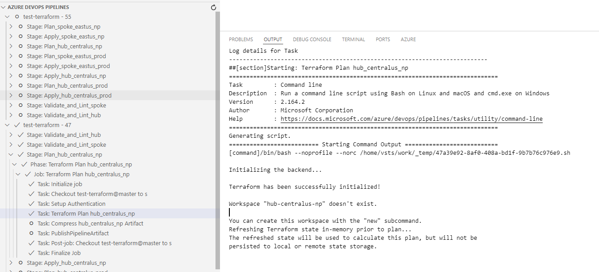
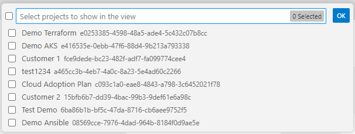

# Azure DevOps Pipeline Explorer

- [Azure DevOps Pipeline Explorer](#azure-devops-pipeline-explorer)
  - [Introduction](#introduction)
  - [Features](#features)
  - [Screenshot](#screenshot)
  - [Azure Devops API Usage](#azure-devops-api-usage)
  - [Installation](#installation)
  - [Usage](#usage)
    - [Configure Azure DevOps Organization URL, Project and PAT](#configure-azure-devops-organization-url-project-and-pat)
    - [Open the Extension view](#open-the-extension-view)
    - [Filter project](#filter-project)
    - [View Pipeline Definitions](#view-pipeline-definitions)
    - [View Pipeline Runs](#view-pipeline-runs)
    - [View Logs](#view-logs)
    - [Update configuration](#update-configuration)
    - [Auto refresh](#auto-refresh)
    - [Auto refresh](#auto-refresh-1)
  - [Settings](#settings)
  - [Requirements](#requirements)
  - [How to Create a PAT in Azure DevOps](#how-to-create-a-pat-in-azure-devops)
  - [Known Issues](#known-issues)
  - [Contributing](#contributing)
  - [Author](#author)


## Introduction

This Visual Studio Code extension connects to Azure DevOps and allows you to select a project and a pipeline definition to view the status of the last pipelines runs and their logs. You can also start and stop a pipeline and approve/reject an pending pipeline.


## Features

- View the project in Azure Devops with a optional filter.
- View the pipeline definition with their folder structure.
- Start and approve pipelines.
- View the last 20 build pipelines in Azure DevOps. 20 is the default settings but it is customizable.
- Display each pipeline stage as a hierarchy in a Vs Code treeview.
- Display detailed pipeline logs by clicking on pipeline items.
- Auto-refresh functionality (configurable interval) for keeping the pipeline view updated.
- Refresh manually using the tree view title button.
- Stop refreshing automatically when no pipelines are in progress.
- Securely store Personal Access Token (PAT) on first use.
- Support Azure Devops Service (Saas) and Azure Devops Server

## Screenshot



## Azure Devops API Usage

The extension use the following Azure Devops apis:

- [/\_apis/build/builds](https://learn.microsoft.com/en-us/rest/api/azure/devops/build/builds/list?view=azure-devops-rest-7.0): to retrieve the last n pipeline execution and list them in the treeview
- [/\_apis/build/builds/<build_id>/Timeline](https://learn.microsoft.com/en-us/rest/api/azure/devops/build/timeline/get?view=azure-devops-rest-7.0): to retrieve the details of each pipeline execution (Stage, Task, job) and display them as a hierarchy in the treeview
- [/\_apis/build/builds/<build_id>/logs/<log_id>](https://learn.microsoft.com/en-us/rest/api/azure/devops/build/builds/get-build-log?view=azure-devops-rest-7.0): to show the detail of a pipeline task in the Output tab

## Installation

1. Click on the extension icon in VS Code and type Azure DevOps Pipeline Explorer.
2. Click on install.

## Usage

### Configure Azure DevOps Organization URL, Project and PAT

When the extension runs for the first time, it will prompt you to enter your Azure DevOps organization URL, Project and Personal Access Token (PAT). The PAT is securely stored for future use and the other parameters are saved in your in your VS Code `settings.json`.

- **Organization URL**: The URL of your Azure DevOps organization (e.g., `https://dev.azure.com/your-organization`).
- **Personal Access Token (PAT)**: The PAT required for authentication. You can create a PAT in Azure DevOps [here](https://docs.microsoft.com/en-us/azure/devops/organizations/accounts/use-personal-access-tokens-to-authenticate).

### Open the Extension view

- Click on the extension icon

   

### Filter project

- Click on the filter icon in the project list view and select the list of project you want to see

  


### View Pipeline Definitions

- Click on a project to show the pipeline definition in the pipeline definition view
- select a pipeline and click on the start icon so start it
- if the pipeline yaml file has a parameter vs code will ask you to input a value

### View Pipeline Runs

- Click on a project to show the pipelines in the pipeline view
- If there is a pipeline in progress the treeview will auto refresh. You can stop the auto refresh with the command "Pipeline Explorer: Stop Auto Refresh".
- The icon of the pipeline item show that state of each stage/task.

### View Logs

- Click on a task from a pipeline to display the logs in the output channel. Each log entry provides detailed information about the pipeline run.

### Update configuration

- Click on the gear icon in the project view to reconfigure the extension and enter the Azure Devops Url and PAT.


### Auto refresh

- You can start auto refresh of the pipeline list in the treeview with the command "Pipeline Explorer: Start Auto Refresh"
- You can stop auto refresh of the pipeline list in the treeview with the command "Pipeline Explorer: Stop Auto Refresh"


### Auto refresh

- You can start auto refresh of the pipeline list in the treeview with the command "Pipeline Explorer: Start Auto Refresh"
- You can stop auto refresh of the pipeline list in the treeview with the command "Pipeline Explorer: Stop Auto Refresh"


## Settings

The extension will configure the following settings automatically in your VS Code `settings.json` during first start:

```json
{
  "pipelineExtension.azureDevOpsOrgUrl": "https://dev.azure.com/your-organization"
}
```

- `pipelineExtension.azureDevOpsOrgUrl`: The URL of your Azure DevOps organization.

There are optional settings that can be added in your VS Code `settings.json`:

```json
{
  "azurePipelinesExplorer.userAgent": "My user agent",
  "azurePipelinesExplorer.azureDevOpsPipelineMaxItems": 20
}
```

- `pipelineExtension.userAgent`: A custom http user agent header.
- `pipelineExtension.azureDevOpsPipelineMaxItems`: The number of pipeline to get from the Azure Devops api /\_apis/build/builds

## Requirements

- Visual Studio Code
- Azure DevOps organization URL
- Azure DevOps project
- Azure DevOps Personal Access Token (PAT)

## How to Create a PAT in Azure DevOps

1. Go to your Azure DevOps organization.
2. Click on your profile icon in the top-right corner and select **Personal Access Tokens**.
3. Click **New Token** and configure the token to have **Read** permissions for pipelines.
4. Copy the PAT and enter it in the extension when prompted.

## Known Issues

- The extension currently supports a single Azure DevOps organization and project. Please create an issue on GitHub if you're interested in multi-organization or multi-project support.

## Contributing

Contributions are welcome! Feel free to open issues and submit pull requests.

## Author

Damien Hauser

https://github.com/damhau/azdo-pipeline-explorer
